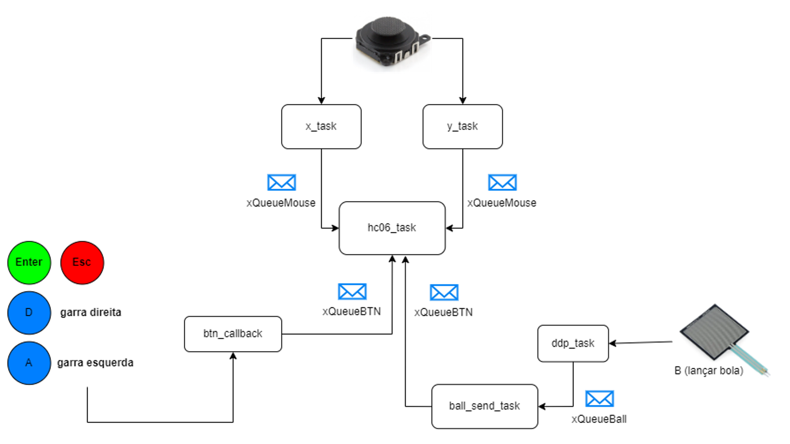

# Controle para Pinball

### Desenvolvido por:
- Beatriz Rodrigues de Freitas
- Ellen Coutinho Lião da Silva

### Diagrama do programa:

### Funcionalidades Extras:

- Vídeo TOP!
- Botão de pressão para lançar a bola (componente novo).
- Vibração ao apertar muito forte o botão de lançar a bola (Haptic Feedback).
- Jogo jogável com o controle.
- Hardware integrado no controle.